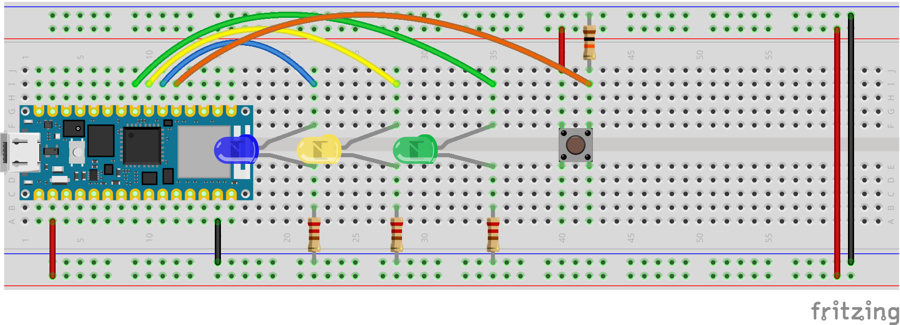

# Node Web Sockets Server for Arduino

## Server Setup 
Clone this repo onto your local machine  
 
### Test locally
- `npm install`
- `npm start`

You can test the socket connection using a cli tool or [Insomnia](https://insomnia.rest/download)

```bash
npm install -g wscat
wscat -c ws://localhost:3000

# Then send messages:
{"type":"buttonPress"}
{"type":"brightness","value":200}

```

### Deploy on Render
Basic node server. This server handles the socket connections. It broadcasts to the clients any messages it receives. The same server works for both examples.

## Arduino Setup
- Code tested for the Arduino Nano IOT
- Build the Circuit

- Test the circuit using the sketch found in [circuit-tester](circuit-tester) folder
- The examples a wifi connection to connect to the web server. Use the sketch in [wifi-tester](wifi-tester) to test your connections

### Example 1 - Turn on the Lights
- A button press on an connected arduino will instantly update the button state on the server.
- This example has no frontend controls, the arduino communicate to each other through a central server.

### Example 2 - Dim, Pulse, and Turn
- This example builds off the previous one. The button still controls the blue led state.
- There is a frontend dashboard with three sliders for brightness, pulse speed, and servo position
- Moving the sliders will control the lights and motor on the Servo.

Note: servo motor should connect red to the Vin pin to get a power boost. This is sort of a hack but works. Black cable to ground. Data cable should connect to D6

[Live Dashboard](https://arduino-websockets-workshop.onrender.com/)

## A Challenge
- Combine the two sketches!
- Connect a force sensor to the Arduino
- Write a p5 sketch the uses the force the change the size of the circle.
  - The higher the force the smaller the circle.

*Hint - You'll either have to change and deploy your own server or highjack one of my value, like brightness 


